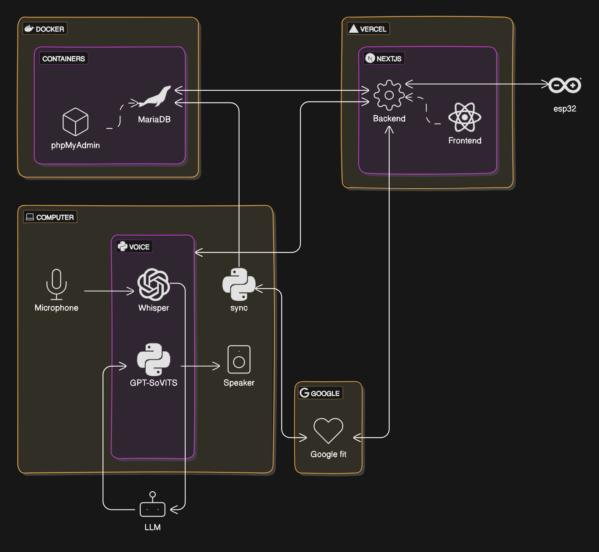

# 居家語音控制整合健康監測系統

德明財經科技大學專題

## 系統架構



匯出套件清單

```bash
pip freeze > requirements.txt
```

安裝清單中的套件

```bash
pip install -r requirements.txt
```

成員名單

- [唯一](https://github.com/sao-coding)
- [天幻宇鷹](https://github.com/jodon920502)
